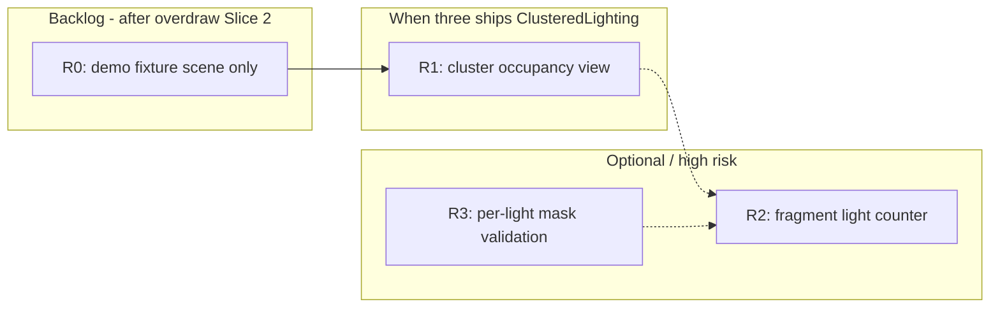

# SDD: Light Complexity / Light Overlap Debug View

> **Status: Shipped** — R0 lights fixture + R2 fragment light counter on default renderer; see [`light-complexity.tasks.md`](./light-complexity.tasks.md).

## Problem

UE5 **Light Complexity** answers: *how many non-static lights shade this pixel?* It is orthogonal to **Shader Complexity** (program cost) and **Overlap/Overdraw** (geometry layer pressure). We have neither today.

Typical Three.js scenes (1 directional + env + few points) stay green — low signal. Value appears with **many overlapping dynamic lights** (archviz fixtures, nightlife, particles with point lights).

## Research Baseline

### Unreal Engine 5

- **Light Complexity** (`viewmode lightcomplexity`): heatmap of **non-static light count** per pixel; green → red/white as overlap grows.
- **Shader Complexity**: instruction estimate — separate mode.
- **Stationary Light Overlap**: bake-time overlap for stationary lights — not a runtime Web target.

Sources:

- [Viewport Modes](https://dev.epicgames.com/documentation/en-us/unreal-engine/viewport-modes-in-unreal-engine)
- [Intel UE4 optimization tutorial](https://www.intel.com/content/www/us/en/developer/articles/training/unreal-engine-4-optimization-tutorial-part-4.html)
- [Unreal Art Optimization](https://unrealartoptimization.github.io/book/profiling/view-modes/)

### Three.js WebGPU (0.184+)

| Capability | Status | Relevance |
|---|---|---|
| Default forward `LightsNode` | In core TSL | Per-pixel light loop — hard to instrument without forking culling |
| `TiledLighting` addon | In three/addons (8 lights/tile limit) | Tile count ≈ coarse light complexity |
| `ClusteredLighting` addon | PR #33406, not in 0.184 npm yet | Best hook: cluster light list length |
| `atomicAdd` + storage buffers | In `three/tsl` | Per-light mask accumulation for fixtures only |

### Community clustered rendering

Forward+ bins lights into screen tiles × depth slices; debug visualization of cluster occupancy is a known pattern (~3 lights/pixel avg vs 1024 in scene). Blocky artifact is acceptable when visualizing tile/cluster data.

## Definitions

### Light overlap count L(p)

For pixel `p`:

```
L(p) = |{ lights ℓ : ℓ is dynamic ∧ contributes to p ∧ not shadow-occluded (optional) }|
```

- **Dynamic** for us: `PointLight`, `SpotLight`, `RectAreaLight`, etc.
- **Exclude from count:** `DirectionalLight`, `AmbientLight`, `HemisphereLight`, environment — they flatten the heatmap (every pixel “lit”).

### Not the same as

| Signal | Question |
|---|---|
| `shaderCost` | How heavy is the material shader? |
| `overdraw` | How many geometry layers shaded/blended? |
| `lightingOnly` | What does lighting look like on neutral albedo? |
| `lightComplexity` | How many lights hit this pixel? |

### UE signal mapping (this package)

```text
lightComplexity   ≈ UE Light Complexity (backlog — not shipped)
overdraw            → see overdraw/measured-overdraw.sdd.md
shaderCost          ≈ UE Shader Complexity (estimate)
quadOverdraw        ≈ UE Quad Overdraw (future)
```

## Approaches (ranked)

### A. Cluster / tile occupancy (preferred when addon ships)

Hook `ClusteredLighting` binning compute output (per-cluster light list length). Rasterize count to pixels in tile × depth slice.

| Pros | Cons |
|---|---|
| Matches production culling | Blocky (32px tiles × Z slices) |
| Cheap | Requires `renderer.lighting = ClusteredLighting` |
| Truthful to Forward+ | Not in three@0.184 — track three ≥0.185 or addon copy |

**Label:** `Estimated Light Overlap (cluster)` — document tile size in legend.

### B. Fragment light counter (high risk — not Slice 1)

Custom `NodeMaterial` / `lightsNode` wrapper that loops analytic lights and counts in-range/in-cone contributions.

| Pros | Cons |
|---|---|
| Per-pixel smooth heatmap | Must mirror Three `LightsNode` culling |
| Works on default renderer | Drifts if app uses custom `lightsNode` |
| | Shadow policy ambiguous |

**Label:** `Estimated Light Overlap` only — not `Measured` until culling matches production and shadow policy is chosen.

### C. Per-light mask passes (fixtures only)

For each dynamic light: render influence mask, `atomicAdd` or `ONE ONE` +1 per pixel.

| Pros | Cons |
|---|---|
| Easy to reason about | O(lights) — impractical at 256+ |
| Good for 2–4 light validation | Never default runtime |

### D. Screen-space analytic (reject)

2D circle overlap in compute — ignores depth, cones, occlusion. Dev cheat only.

## Recommended Strategy



| Phase | What | When |
|---|---|---|
| **R0** | Demo fixture: 4–6 overlapping `PointLight`s; URL preset `?scene=lights` — **no new debug view** | After measured overdraw Slice 2 |
| **R1** | Cluster occupancy view; hook binning buffer | When `ClusteredLighting` lands in three npm |
| **R2** | Fragment light counter | Only if stable `lightsNode` / culling API — high risk |
| **R3** | Per-light mask passes | Vitest fixtures only (2–4 lights) |

Do **not** block measured overdraw on light complexity.

## Near-term: explicitly out of scope

Until R1:

- `usesLightComplexityPass` in `debug-render-plan.ts`
- `lightComplexity` in `compositor.ts` / `DEFAULT_DEBUG_VIEWS`
- New implementation files under `lighting/`
- E2E for `debugView=lightComplexity`

## Future Implementation Sketch (R1 — Cluster hook)

When `ClusteredLighting` is available:

1. Version gate `three >= 0.185` (TBD).
2. After binning compute, read `clusterLightCounts` (or equivalent upstream buffer).
3. Debug compute: cluster ID from depth → count → upscale to full res (nearest).
4. Source `lightComplexity` with label `Estimated Light Overlap (cluster)`.

Investigate:

- `three/addons/tsl/lighting/ClusteredLighting.js` (name may change)
- Binning compute node outputs

## Future Implementation Sketch (R2 — Fragment counter)

Only if R1 is insufficient and `LightsNode` API stabilizes:

- Mirror `lightingOnlyPass` slot in `debug-pipeline-runtime.ts`
- `lighting/light-complexity-material.ts` — count before BRDF
- **Policy v1:** ignore shadow maps (document limitation)
- **Policy v2:** sample shadow attenuation
- `maxDisplayLights` default 8; legend `0 / 1 / 2 / 4 / 8+`

## Demo Fixture (R0)

`src/demo/light-overlap-scene.ts` or extend overlap scene:

- Dark room, 3–6 `PointLight` with overlapping radii
- No `lightComplexity` view required — validates scene for later R1/R2
- Optional screenshot with `lightingOnly` for docs

## Acceptance Criteria

### R0

- [ ] Fixture scene renders with overlapping point lights
- [ ] No new pipeline flags or built-in view

### R1 (when addon ships)

- [ ] Cluster view correlates with Forward+ demo (blocky acceptable)
- [ ] Legend uses **lights** not layers/instructions
- [ ] `lightComplexity` ≠ `shaderCost` ≠ `overdraw` on same camera
- [ ] Directional/ambient/env excluded from count

### R2 (if pursued)

- [ ] 2 overlapping point lights → center L ≥ 2
- [ ] Label `Estimated Light Overlap` — shadows documented

## Must Not Do

- Do not call this “shader complexity”
- Do not merge light count into `overdraw` or `shaderCost`
- Do not label v1 `Measured` without production culling parity
- Do not imply UE parity for stationary bake overlap
- Do not run per-light O(N) passes in default runtime
- Do not add to `DEFAULT_DEBUG_VIEWS` before R1/R2 and a demo with signal

## Dependencies

| Work | Depends on |
|---|---|
| Measured overdraw Slice 2 | None — prioritize first |
| Light R0 fixture | Measured overdraw Slice 2 |
| Light R1 cluster view | Three.js `ClusteredLighting` release |
| Light R2 fragment counter | Stable `lightsNode` API (uncertain) |

## Verification (when implemented)

```bash
pnpm typecheck
pnpm test
pnpm test:e2e
```

Manual: lights demo vs foliage overlap demo — three distinct heatmaps when views exist.
