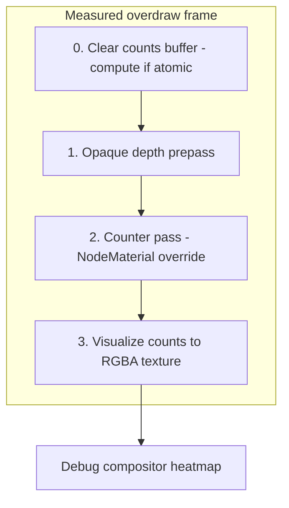
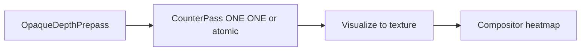
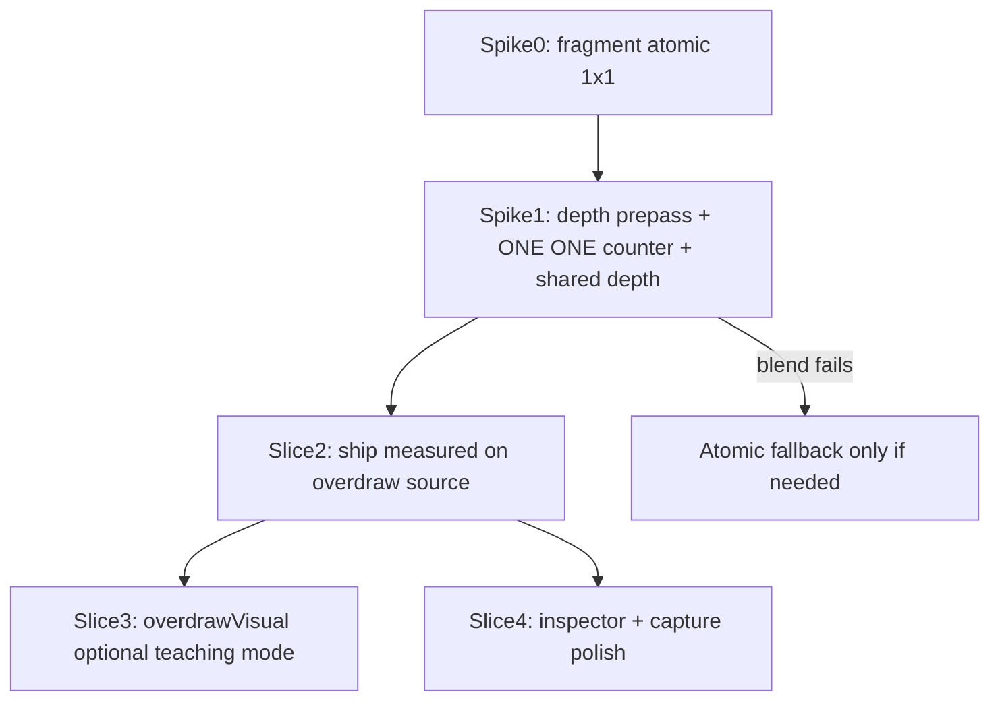

# SDD: Measured Overdraw / Overlap Debug View

> **Status: Shipped** — blend-counter v1 on `overdraw` source; see [`measured-overdraw.tasks.md`](./measured-overdraw.tasks.md).

Single source of truth for measured overlap (`overdraw`), optional visual aid (`overdrawVisual`), and future quad overdraw.

## Problem

The current `overdraw` view is an engine-style approximation: it replaces eligible materials with additive transparent debug materials and visualizes accumulated brightness. That is useful as a teaching view, but it is not a read of how many times a screen pixel was shaded or blended.

The current approximation also contains presentation constants:

- replacement opacity (`0.18`)
- heatmap scale (`scale: 2.5`)
- contributor filtering with depth disabled

Those are fine for a quick visual aid, but they are not a measurement contract.

## Research Baseline

### Godot

Godot `Debug Draw = Overdraw` draws meshes semi-transparent with additive blending so mesh overlap is visible. This is a visual replacement-mode diagnostic, not a numeric per-pixel counter.

Source: https://docs.godotengine.org/en/4.4/tutorials/rendering/viewports.html

### Unity

Unity exposes an `Overdraw` scene draw mode. Public Unity docs describe it as rendering objects over one another in the Scene view. Community and issue-tracker discussion confirm the classic mode is effectively additive replacement rendering with depth behavior changed, which means it can show hidden geometry pressure but is not strict “actual shaded pixel count.”

Sources:

- https://docs.unity.cn/Manual/ViewModes.html
- https://discussions.unity.com/t/sceneview-overdraw-mode-is-misleading/711840
- https://issuetracker.unity3d.com/issues/the-scene-view-draw-mode-overdraw-does-not-work-as-expected

### Unreal Engine

Unreal separates optimization view modes. That separation matters:

| UE mode | What it measures | Opaque role |
|---|---|---|
| **Shader Complexity** | Instruction sum per pixel (translucent stacks add; opaque behind opaque is z-culled → ~1) | Cost of the winning opaque shader, not hidden opaque layers |
| **Quad Overdraw** | Quad/pixel execution pressure — translucent stacks and tiny triangles on opaque LOD/landscape | Highlights dense opaque tessellation (overshading), not “2 opaque meshes stacked” |
| **Light Complexity** | Dynamic lights per pixel | Unrelated to geometry layers |

Sources:

- https://dev.epicgames.com/documentation/unreal-engine/API/Runtime/Engine/EDebugViewShaderMode
- https://dev.epicgames.com/documentation/en-us/unreal-engine/viewport-modes-in-unreal-engine
- https://unrealartoptimization.github.io/book/profiling/view-modes/
- https://www.gamedeveloper.com/programming/gpu-performance-for-game-artists

**Key insight:** For opaque meshes, z-buffer culling means “overdraw” is mostly a non-issue; the real opaque pain is quad overshading (small triangles), which is a different metric than layer counting.

### Takeaway

There are two different products:

1. **Visual overlap aid**: additive replacement rendering, useful for seeing overlapping meshes.
2. **Measured pixel layer count**: explicit per-pixel counters for translucent/alpha-cutout contributors, useful for reasoning about real fill/blend pressure.

Our current implementation is item 1. The target revision is item 2.

### UE signal mapping (this package)

```text
overdraw (v1)     ≈ measured translucent/alpha-cutout layer count (not one UE mode)
shaderCost        ≈ UE Shader Complexity (estimate, not instruction count)
quadOverdraw      ≈ UE Quad Overdraw (future)
lightComplexity   ≈ UE Light Complexity (see lighting/light-complexity.sdd.md)
```

## User Stories

Inferred from README, docs, demo scenes, and E2E/capture flows:

| ID | Story | Primary view | Opaque counting? |
|---|---|---|---|
| **US-O1** | As a WebGPU dev, I want to see how many alpha-card/foliage layers stack at a pixel so I can tune vegetation density. | `overdraw` | Prepass only (occlusion), do not count cliff/rocks |
| **US-O2** | As a dev, I want glass / stacked transparent pressure as an integer, not brightness. | `overdraw` | Same; optional glass fixture in tests |
| **US-O3** | As a dev, I want shader cost and overlap orthogonal — not one blended heatmap. | `shaderCost` + `overdraw` | N/A |
| **US-O4** | As a docs/demo author, I want breakdown layouts + social capture that show overlap hotspots on the foliage scene. | `overdraw` + layouts | Hotspots on cards, not terrain |
| **US-O5** | As a dev, I want to click a pixel and read a layer count, like shader-cost inspector. | `overdraw` inspector (Slice 4) | Integer from R channel |
| **US-O6** | As a learner, I want a quick additive overlap hint without claiming measurement. | `overdrawVisual` (Slice 3) | Current approx behavior |

None of the overlap user stories require opaque layer counting. US-O1 and US-O4 are actively harmed by counting opaque fragments.

Our demo (`src/components/Scene.tsx` — `FoliageOverdrawScene`): alpha-tested cards (`alphaTest`, `transparent`, `depthWrite: false`) over opaque cliff/ground. The user story is foliage/card layer pressure, not cliff triangle density.

## Definitions

### Pixel layer count C(p)

For pixel `p`, count surviving fragment contributions from **contributor geometry** after alpha discard and depth occlusion from opaque prepass:

```
C(p) = Σᵢ 𝟙[fragmentᵢ(p) survives alpha ∧ depth test ∧ contributor class]
```

Not shader cost. Not light count. Not quad count (separate future view).

### Contributor scope (v1 default)

**Count:** translucent + alpha-cutout contributors that participate in the counter pass.

**Do not count:** opaque solid meshes — they write depth in prepass but do not increment `C(p)`.

**Reject for v1:** counting all surviving opaque fragments — screen becomes ~1 everywhere and hides foliage/glass signal.

**Defer post-v1:** optional `overdrawScope: 'contributors' | 'allSurvivingFragments'` only if a second user story demands it.

### Material classification (three-way)

Extract from `overdraw-override.ts` into `overdraw-classification.ts`:

| Class | Examples | Prepass | Counter |
|---|---|---|---|
| `opaqueSolid` | Cliff, ground, rocks | depth write | skip |
| `alphaCutout` | Foliage cards with `alphaTest` | depth write if opaque-like; counter if `transparent` + `depthWrite: false` | counter when contributor |
| `transparentContributor` | Glass, stacked transparent | skip | increment per surviving fragment |

Foliage in the demo is both `alphaTest` and `transparent` with `depthWrite: false` → counter pass, depth-tested against prepass.

### Quad Overdraw

Pressure caused by rasterization and pixel shader execution in 2×2 pixel quads. Not identical to pixel layer count. Future source `quadOverdraw` — do not merge into `overdraw`.

### Shader Complexity

Estimated material/program cost. Separate view (`shaderCost`). Must not be merged into overdraw.

## Target Contract

Two overdraw-related sources:

1. **`overdraw`** (measured, ships on `overdraw` source)
   - Label: `Measured Overlap` (rename in same PR as behavior swap — do not rename before measured path works)
   - Integer layer count per pixel for contributors
   - Legend: `0 / 1 / 4 / 8+ layers`
   - No magic `opacity` or `scale: 2.5` defining meaning
   - Linear R channel encodes `count / maxDisplayLayers` for inspector; heatmap is display-only

2. **`overdrawVisual`** (optional, Slice 3)
   - Godot/Unity-style additive replacement
   - Label: `Overlap Visualization (approx)`
   - Allowed presentation scale
   - Not in `DEFAULT_DEBUG_VIEWS` unless demo needs side-by-side comparison

Optional future:

3. **`quadOverdraw`**
   - 2×2 quad pressure reduction
   - UE Quad Overdraw analogue
   - Separate source and legend

## Pipeline Architecture

Measured overdraw is not a single `pass(scene, camera)` with `MeshBasicMaterial`. It is a small runtime subgraph:





### Pass 0 — Clear buffer (atomic path only)

- `StorageBufferAttribute(width * height, 1, Uint32Array)` via `attributeArray(count, 'uint')` from `three/tsl`
- GPU compute clear each frame
- Resize when viewport / `resolutionScale` changes
- Skip for blend-counter v1 (framebuffer starts at 0)

### Pass 1 — Opaque depth prepass

Reuse scene + camera. Share depth texture with counter pass (`PassNode` depth bind — spike required).

| Object | Material | Color | Depth |
|---|---|---|---|
| `opaqueSolid` | Depth-only override | off | write |
| `alphaCutout` (depth participant) | Preserve `alphaTest` / `alphaMap` discard | off | write |
| Contributors (`transparent`, counter-only) | Hidden | — | — |

Purpose:

- preserve occlusion from rocks/terrain
- avoid counting transparent foliage hidden behind opaque geometry
- match normal frame depth rejection better than disabling depth

Today opaque meshes are **hidden** in visual approx (`overdraw-override.test.ts` expects `visible = false`). Measured path must **write depth**, not hide.

### Pass 2 — Counter pass

Traverse scene; swap contributor materials to cached `NodeMaterial` counter shaders.

**Path A — Blend counter (ship v1):**

Per surviving fragment: `outColor = vec4(1,0,0,0)`, blend `ONE ONE`, depth test on, depth write off.

`C(p) ≈ framebuffer.r` after pass. Order-independent for counting. Limits: float precision (~24 bits), usually fine for &lt;64 layers.

**Path B — Atomic storage (fallback only if blend fails fixtures):**

```wgsl
let idx = u32(fragment.y) * width + u32(fragment.x);
atomicAdd(&counts[idx], 1u);
```

Three.js 0.184+ exposes `atomicAdd`, `attributeArray`, `storage` from `three/tsl`.

Do not ship dual `measuredOverdrawMode: 'atomic' | 'blend'` until a real platform failure is documented.

Preserve from visual override:

- `alphaMap`, `alphaTest`, `alphaHash`, `side`
- Do not use `opacity: 0.18` or `AdditiveBlending`

### Pass 3 — Visualize

Compute or fullscreen pass: `normalized = count / maxDisplayLayers` (default 16, legend clamps at 8+).

Reuse `visualizeHeatmap()` for display. Inspector reads linear R — do not use `decodeHeatmapCost()` for integer layers.

Expose via `getTextureNode('output')` matching current `OverdrawPass` interface in `debug-pipeline-runtime.ts`.

## Delivery Slices



### Spike 0 — Atomic feasibility (non-blocking)

1×1 `NodeMaterial` + `atomicAdd` → readback `1`. Document pass/fail. Does not block ship if blend works.

### Spike 1 — Blend counter (blocking)

Two `PassNode`s with shared depth texture. Fixtures:

- 1/2/4 stacked ortho quads → R = 1/2/4 ± ε
- Opaque blocker → 0 behind
- Alpha cutout half/half
- Foliage-over-cliff integration (demo-shaped)

### Slice 2 — Ship measured (one PR)

- Replace `createOverdrawPass` additive path with measured subgraph
- `debug-view-definitions.ts`: remove `scale: 2.5`; label `Measured Overlap`
- `debug-views-overlays.tsx`: layer legend `0 / 1 / 4 / 8+`
- E2E/capture: `tests/e2e/debug-demo-flows.spec.ts`, `scripts/capture-social-overlap-breakdown.mjs`
- Single `usesOverdrawPass` flag (no split until `overdrawVisual` ships)

### Slice 3 — `overdrawVisual` (optional)

- Register `overdrawVisual` source; move `overdraw-override.ts` behavior there
- Add `usesOverdrawVisualPass` when implemented

### Slice 4 — Inspector + polish

- Click pixel → integer layer count from R channel
- Update `pnpm capture:social` screenshots
- Docs: counter pass ≈ one extra transparent pass + small visualize cost

### Defer

- `quadOverdraw`
- Composite `shaderCost × overdraw`
- Atomics v1 unless blend fails Spike 1
- Particles/`Points` unless trivial mesh traverse extension
- Label rename before measured behavior ships

## Implementation Files

**Target: 2 new implementation files** (not 6):

| File | Responsibility |
|---|---|
| `overdraw/overdraw-classification.ts` | `opaqueSolid`, `alphaCutout`, `transparentContributor` |
| `overdraw/measured-overdraw-pass.ts` | Materials, visualize, clear/prepass/counter/viz runtime, `getTextureNode()` |
| `overdraw/measured-overdraw.test.ts` | Classification + buffer sizing + fixture scenes (inline ortho quads, optional glass stack) |

**Modified:**

- `debug-view-definitions.ts`
- `debug-render-plan.ts` — `usesOverdrawPass`; add `usesOverdrawVisualPass` in Slice 3 only
- `debug-pipeline-runtime.ts`
- `debug-views-tsl/default-debug-nodes.ts`
- `debug-views-tsl/compositor.ts` — `overdrawVisual` in Slice 3
- `debug-views-overlays.tsx`

Extend `createDebugPipelineRuntimeKey` with viewport dimensions so buffer resize rebuilds pipeline.

## Acceptance Criteria

### Correctness fixtures

| Case | Expected C(p) |
|---|---|
| Single transparent quad | 1 |
| 2 stacked quads (same screen rect) | 2 |
| 4 stacked quads | 4 |
| Opaque blocker in front | 0 behind blocker |
| Alpha test 50% checker | 0 discarded; surviving = stack depth |
| Foliage-over-cliff (`FoliageOverdrawScene`) | Hotspots on cards; cliff/ground not high overlap |
| Optional stacked glass quads (US-O2) | 1/2/4 in unit fixture |

### Visual acceptance

- `overdraw` screenshot shows measured layer hotspots
- `shaderCost` differs from `overdraw` on same camera
- Opaque terrain does not dominate unless explicit all-geometry mode (deferred)

### UI acceptance

- Legend uses layer nouns: `0 layers`, `1 layer`, `4 layers`, `8+ layers`
- View label `Measured Overlap` only when measured path ships
- `overdrawVisual` label `Overlap Visualization (approx)` if kept

## Performance and Limits

- Atomic buffer: `4 × W × H` bytes (uint32). 1080p ≈ 8 MB — debug-only
- Lazy pass creation when layout needs `overdraw` (existing pattern)
- Counts in render-target space when `resolutionScale` is 0.5 or 0.25 — document in legend/inspector

## Must Not Do

- Do not rename to “Measured” before behavior ships
- Do not tune `opacity` / `scale` until screenshot “looks hot”
- Do not fold layer count into `shaderCost`
- Do not disable depth test on measured path
- Do not count opaque solid in v1 default scope
- Do not claim exact hardware quad execution in pixel-count view
- Do not ship `measuredOverdrawMode` toggle without documented platform failure

## Non-Goals

- Exact hardware instruction count
- UE Stationary Light Overlap (bake-time)
- Per-light O(N) mask passes in default runtime
- WebGL fallback

## Verification

```bash
pnpm typecheck
pnpm test
pnpm test:e2e
pnpm build:demo
```

Manual: Chrome WebGPU — compare `overdrawVisual` vs `overdraw` on demo overlap scene; confirm legend reads layers not cost.
