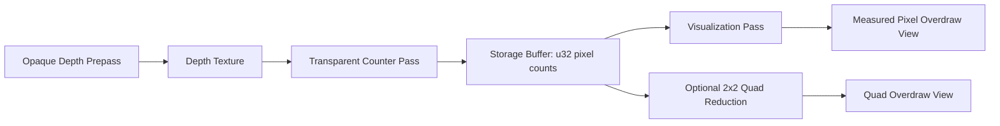

# SDD: Real Overdraw / Pixel Pressure Debug View

## Problem

The current `overdraw` view is an engine-style approximation: it replaces eligible materials with additive transparent debug materials and visualizes accumulated brightness. That is useful as a teaching view, but it is not a real read of how many times a screen pixel was shaded or blended.

The current approximation also contains presentation constants:

- replacement opacity
- heatmap scale
- contributor filtering

Those are fine for a quick visual aid, but they are not a measurement contract.

## Research Baseline

### Godot

Godot `Debug Draw = Overdraw` draws meshes semi-transparent with additive blending so mesh overlap is visible. This is a visual replacement-mode diagnostic, not a numeric per-pixel counter.

Source: https://docs.godotengine.org/en/4.4/tutorials/rendering/viewports.html

### Unity

Unity exposes an `Overdraw` scene draw mode. Public Unity docs describe it as rendering objects over one another in the Scene view. Community and issue-tracker discussion confirm the classic mode is effectively additive replacement rendering with depth behavior changed, which means it can show hidden geometry pressure but is not strict “actual shaded pixel count.”

Sources:

- https://docs.unity.cn/Manual/ViewModes.html
- https://discussions.unity.com/t/sceneview-overdraw-mode-is-misleading/711840
- https://issuetracker.unity3d.com/issues/the-scene-view-draw-mode-overdraw-does-not-work-as-expected

### Unreal

Unreal separates shader complexity from quad overdraw modes. That separation matters: shader complexity estimates program cost, while quad overdraw is about 2x2 pixel quad pressure and layered fragment work.

Source: https://dev.epicgames.com/documentation/unreal-engine/API/Runtime/Engine/EDebugViewShaderMode

### Takeaway

There are two different products:

1. **Visual overlap aid**: additive replacement rendering, useful for seeing overlapping meshes.
2. **Measured pixel/quad pressure**: explicit per-pixel or per-quad counters, useful for reasoning about real fill/blend pressure.

Our current implementation is item 1. The requested revision is item 2.

## Definitions

### Pixel Overdraw

Number of surviving fragment contributions at a screen pixel for a selected geometry class.

For foliage/transparency, this should count fragments after alpha coverage/discard and after relevant depth occlusion.

### Quad Overdraw

Pressure caused by rasterization and pixel shader execution in 2x2 pixel quads. This is not identical to pixel overdraw. Small triangles and alpha-tested cards can execute larger shader quads than their final visible coverage suggests.

### Shader Complexity

Estimated material/program cost. This is separate from overdraw and must not be merged into the overdraw view.

## Target Contract

Add two separate overdraw views:

1. `overdrawVisual`
   - Godot/Unity-style additive replacement view.
   - Label: `Overlap Visualization`.
   - Allowed to use presentation scale.
   - Must be documented as approximate.

2. `overdraw`
   - Measured transparent pixel coverage count.
   - Label: `Measured Pixel Overdraw`.
   - Reads a counter buffer, not additive color intensity.
   - Legend represents measured layer count.

Optional future:

3. `quadOverdraw`
   - Approximated 2x2 quad pressure.
   - Label: `Quad Overdraw`.
   - Separate from pixel overdraw because the signal is different.

## Proposed WebGPU Implementation

### Pass 1: Opaque Depth Prepass

Render opaque scene geometry to a depth texture.

Purpose:

- preserve occlusion from rocks/terrain
- avoid counting transparent foliage hidden behind opaque geometry
- match the normal frame’s depth rejection better than disabling depth completely

Rules:

- color writes disabled or ignored
- depth write enabled
- opaque materials only
- alpha-cutout opaque materials need their alpha discard preserved if they participate in depth

### Pass 2: Transparent Counter Pass

Render transparent / alpha-tested contributors with custom counter shaders.

For each surviving fragment:

```wgsl
let pixel = vec2<u32>(floor(fragment_position.xy));
let index = pixel.y * frame_width + pixel.x;
atomicAdd(&overdraw_counts[index], 1u);
```

Output target can be a dummy render target. The real signal is the storage buffer.

Rules:

- use the opaque depth texture from pass 1
- depth test enabled
- depth write disabled
- preserve alpha texture sampling and alpha test
- preserve material side/culling enough for foliage cards
- do not use replacement opacity as the signal

### Pass 3: Normalize / Visualize

Convert the storage counter buffer into a visual texture.

Options:

- compute pass writes an `rgba8unorm` or float texture
- fullscreen pass samples a count buffer through an intermediate texture

Legend should be count-based:

- `0 layers`
- `1 layer`
- `4 layers`
- `8+ layers`

No magic `opacity` or `scale` should define the meaning. Scaling is only a display range, and the UI must show the range.

## Quad Overdraw Path

Pixel overdraw is not quad overdraw. For a future `quadOverdraw` view:

1. Generate pixel coverage counts first.
2. Run a compute pass over 2x2 blocks.
3. Store max/sum pressure per quad.
4. Visualize separately.

This is still an approximation of hardware quad execution, but it is conceptually closer than additive color blending.

## Data Model



## API / Files

### New files

- `components/debug-views/overdraw/overdraw-counter-pass.ts`
- `components/debug-views/overdraw/overdraw-counter-materials.ts`
- `components/debug-views/overdraw/overdraw-visualize.ts`
- `components/debug-views/overdraw/overdraw-counter-pass.test.ts`

### Existing files to revise

- `components/debug-views/debug-view-definitions.ts`
  - rename current approximation to `overdrawVisual` or mark it approximate
  - register measured `overdraw`
- `components/debug-views/debug-render-plan.ts`
  - distinguish `usesOverdrawVisualPass` from `usesMeasuredOverdrawPass`
- `components/debug-views/debug-views-r3f.tsx`
- `components/debug-views/debug-viewport-renderer.ts`
- `components/debug-views/debug-pipeline-runtime.ts`
  - route measured overdraw through counter runtime, not `pass(scene, camera)` replacement material only
- `components/debug-views/debug-views-tsl/default-debug-nodes.ts`
  - resolve measured overdraw texture/counter visualization
- `src/components/Scene.tsx`
  - keep stacked foliage fixtures, but do not depend on magic heatmap constants to prove overlap

## Acceptance Criteria

### Correctness fixtures

Build a deterministic test scene with screen-aligned transparent quads:

- 1 quad covering the same pixel region -> measured count = 1
- 2 stacked quads -> measured count = 2
- 4 stacked quads -> measured count = 4
- alpha map with half discarded pixels -> discarded pixels count 0, surviving pixels count expected stack depth
- opaque blocker in front -> transparent contributors behind blocker count 0

### Visual acceptance

- `overdraw` screenshot clearly shows measured layer count hotspots.
- `shaderCost` screenshot differs from `overdraw`.
- Opaque terrain does not dominate transparent foliage overdraw unless an explicit “all geometry pressure” mode is selected.

### UI acceptance

- legend uses count nouns, not cost nouns:
  - `0 layers`
  - `1 layer`
  - `4 layers`
  - `8+ layers`
- view label says `Measured Pixel Overdraw`
- approximate replacement mode, if kept, says `Overlap Visualization`

## Non-Goals

- Do not claim exact hardware instruction count.
- Do not claim exact hardware quad execution for the pixel-count view.
- Do not use replacement opacity as the measured value.
- Do not tune a scene until the screenshot “looks hot” and call it measurement.

## Migration Plan

1. Rename current additive replacement pass to `overdrawVisual`.
2. Add measured `overdraw` counter pass behind a WebGPU-only runtime.
3. Keep fallback behavior explicit: measured overdraw is unavailable without native WebGPU.
4. Add the fixture tests before exposing the view as the primary overdraw mode.
5. Replace demo screenshots with measured overdraw screenshots.

## Verification

```bash
pnpm typecheck
pnpm test
pnpm build:demo
```

Browser verification:

- native Chrome with WebGPU enabled
- capture `beauty`
- capture `overdraw`
- capture `overdrawVisual`
- capture `shaderCost`
- confirm no fallback to WebGL
