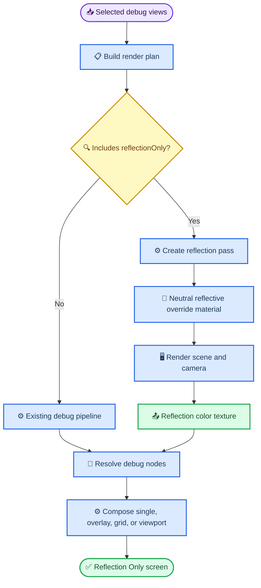
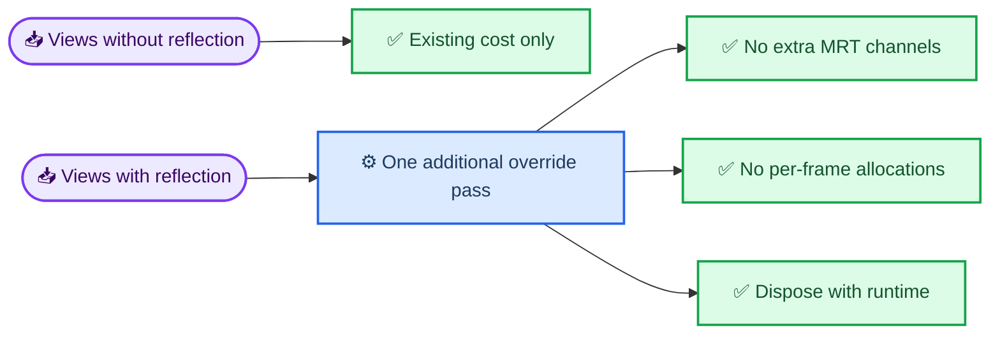

# Reflection Only Debug View SDD

## Intent

Add a built-in `Reflection Only` screen/debug view that isolates the scene's reflection/specular contribution without albedo/base-color influence, following the same proven shape as the clouds-shadow project: render an auxiliary pass, preserve renderer state, then composite or display the diagnostic result as a normal debug view.

## Research Notes

### clouds-shadow reference

Source studied:
- `G:/Antonio Bonet/clouds-shadow/components/clouds/cloud-shadow-post.tsx`
- `G:/Antonio Bonet/clouds-shadow/components/clouds/cloud-shadow-tsl/projected-cloud-shadow.ts`
- `G:/Antonio Bonet/clouds-shadow/src/App.tsx`

Relevant pattern:
- The clouds-shadow post pass renders the scene once through `pass(scene, camera)`.
- For the normal output, it renders an auxiliary `indirectLightTarget` with the primary directional light temporarily disabled.
- It explicitly preserves/restores renderer state: render target, auto-clear, tone mapping, output color space, XR, and light state.
- The TSL composite computes `directColor = fullScene - indirectScene`, then attenuates only the direct component.
- Debug screens are not separate UI components; they are selected by `debugMode` and returned directly from the TSL node (`scene-mask`, `texture-mask`).

What we should copy conceptually:
- Treat the diagnostic as a separate render path, not a guessed post-process from final color.
- Keep state restoration strict.
- Make the debug view selectable through existing debug-view plumbing.

What we should NOT copy blindly:
- Do not build this as an app query-param-only branch. This library already has `DebugViewSource`, `DEFAULT_DEBUG_VIEWS`, render plans, and viewport composition.
- Do not fake reflection by subtracting arbitrary colors in a post pass. Reflection/specular isolation needs material/light/environment behavior to be rendered under controlled material conditions.

### threejs-debug-view current architecture

Source studied:
- `components/debug-views/debug-view-definitions.ts`
- `components/debug-views/debug-render-plan.ts`
- `components/debug-views/debug-pipeline-runtime.ts`
- `components/debug-views/debug-viewport-renderer.ts`
- `components/debug-views/debug-views-tsl/default-debug-nodes.ts`
- `components/debug-views/debug-views-tsl/compositor.ts`

Current built-in debug views fall into three buckets:
- MRT scene outputs: normal, albedo, scalar material channels.
- Dedicated override passes: wireframe, lighting-only.
- Material detail MRT pass: material normal, emissive.

`Lighting Only` already proves the right extension point for this feature: add a render-plan boolean, create a dedicated `pass(scene, camera)`, set an override material, and expose its output through `createDefaultDebugNodeResolver`.

### Three.js r184 TSL/material evidence

Source studied:
- `G:/Antonio Bonet/threejs-debug-view/node_modules/.pnpm/three@0.184.0/node_modules/three/src/nodes/accessors/MaterialNode.js`
- `G:/Antonio Bonet/threejs-debug-view/node_modules/.pnpm/three@0.184.0/node_modules/three/src/nodes/accessors/MaterialProperties.js`

Available material nodes include:
- `materialReflectivity`
- `materialSpecular`
- `materialSpecularIntensity`
- `materialSpecularColor`
- `materialRoughness`
- `materialMetalness`
- `materialClearcoat`
- `materialIOR`
- `materialEnvIntensity`

However, those nodes describe material parameters, not the final reflected radiance. A `Reflection Only` view should show light/environment reflection response, so a dedicated render pass is more honest than a scalar material-channel visualization.

## Proposed Contract

### Public source

Add a new built-in source:

```ts
type DebugViewSource = ... | "reflectionOnly"
```

Add it to:
- `DEFAULT_DEBUG_VIEWS` with label `Reflection Only`
- `MATERIAL_DEBUG_VIEW_SOURCES`
- docs/examples after `Lighting Only` or near material lighting views

### Meaning

`Reflection Only` renders the scene with an override reflective neutral material:

- base color: black or near-black, so diffuse/albedo does not dominate
- metalness: `1`
- roughness: configurable later, default around `0.18`
- toneMapped: default material behavior unless tests prove it should be disabled

This is a diagnostic for reflective/specular/environment response, not a physically exact decomposition of the original material's BRDF.

Important naming discipline: this is `Reflection Only`, not `Specular Only`, because the pass intentionally uses a neutral reflective material and shows the resulting reflected lighting/environment. If we later need true material-authored specular lobe isolation, that should be a separate `specularOnly` feature.

## Optimization Strategy

The naive version is "always add another full-scene pass." That works, but it's lazy. The optimized version treats `Reflection Only` as a demand-driven pass that only exists when selected by the render plan.

### Core optimization rules

| Area | Optimized choice | Why |
| --- | --- | --- |
| Pass allocation | Create `reflectionOnlyPass` only when `usesReflectionOnlyPass` is true | Avoid extra GPU work for every other view |
| MRT outputs | Do not add reflection to the scene MRT | Reflection is a separate lighting response, not a material scalar |
| Texture precision | Use the default pass output; avoid extra low-precision attachments | Reflection needs visible color range, unlike scalar debug maps |
| Material object | Reuse one override material per runtime and dispose it with the pass | Avoid per-frame allocation and leaks |
| Viewport mode | One pass per unique viewport graph pass, already deduped by the viewport graph planner | Avoid re-rendering the same reflection view for repeated cells |
| Fallback behavior | Return `BLACK` when the pass is absent | Keeps resolver total and avoids crashing custom/misplanned views |
| Future configurability | Keep roughness hard-coded initially; expose options only after usage proves need | Prevents API bloat before we know the real pressure |

### Pass scheduling rule

`Reflection Only` belongs beside `Lighting Only` and `Wireframe`, not inside `configureSceneDebugPass`.

Reason: if we push reflection into the scene MRT, every composed layout that includes reflection drags the main scene pass into broader outputs and tempts us to approximate reflection from material parameters. That's the exact shortcut that produces pretty lies. A diagnostic view should be boring and honest.

## Whiteboard



### Runtime mental model



## Design

### Render plan

Extend `DebugRenderPlan`:

```ts
usesReflectionOnlyPass: boolean
```

Set it when any selected default view source is `reflectionOnly`.

### Runtime pass

In `createDebugPipelineRuntime`:

```ts
const reflectionOnlyPass = plan.usesReflectionOnlyPass ? pass(scene, camera) : undefined

if (reflectionOnlyPass) {
  reflectionOnlyPass.setResolutionScale(resolutionScale)
  reflectionOnlyPass.overrideMaterial = new MeshStandardMaterial({
    color: 0x000000,
    metalness: 1,
    roughness: 0.18,
  })
}
```

Dispose both `overrideMaterial` and pass, matching wireframe/lighting-only cleanup.

### Node resolver

Extend `DefaultDebugNodeResolverOptions`:

```ts
reflectionOnlyPass?: DebugPass
```

Resolve:

```ts
case "reflectionOnly":
  return cached("reflectionOnly", () => options.reflectionOnlyPass?.getTextureNode("output") ?? BLACK)
```

### View composition

No new compositor behavior required. The reflection pass returns a normal color texture and uses `mode: "passthrough"`.

### Viewport mode

No special viewport implementation required. The existing viewport render graph creates one runtime per view, so the reflection-only pass follows the same path as lighting-only and wireframe.

## Acceptance Criteria

- `DEFAULT_DEBUG_VIEWS` includes a stable `Reflection Only` built-in source.
- Single-view selection plans only the active reflection view.
- Overlay/grid/viewport selection can include reflection without allocating unrelated MRT outputs.
- The render plan sets `usesReflectionOnlyPass` only when selected views need it.
- `createDebugPipelineRuntime` creates and disposes a dedicated reflection override pass.
- Fallback node is black if the pass is unavailable, matching other dedicated-pass safety behavior.
- Existing tests continue to pass.
- Add regression tests analogous to `Lighting Only`.

## Tasks

- [x] Add `reflectionOnly` to `DebugViewSource`.
- [x] Register `Reflection Only` in `DEFAULT_DEBUG_VIEWS`.
- [x] Add `reflectionOnly` to `MATERIAL_DEBUG_VIEW_SOURCES`.
- [x] Extend `DebugRenderPlan` with `usesReflectionOnlyPass`.
- [x] Add render-plan unit tests for single-view and no-unrelated-MRT behavior.
- [x] Add `reflectionOnlyPass` to the default node resolver.
- [x] Add the dedicated `MeshStandardMaterial` override pass and cleanup.
- [x] Update README/docs built-in view list.
- [x] Run typecheck/tests.

## Risks / Tradeoffs

- This is a diagnostic approximation. It answers "where do reflections show up under a neutral reflective material?", not "what exact reflection term did each original material contribute?"
- A black metallic override may hide non-environment reflection in poorly lit scenes. If that becomes a problem, add options later rather than widening the first API.
- Exact BRDF-term isolation would require deeper renderer/shader hooks and would be much more fragile across Three.js versions.
