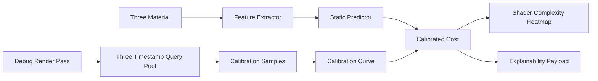

# SDD: Calibrated Shader Cost And GPU Timing

## Current Truth

The current shader-cost heatmap is an estimated debug view. That is the right user-facing contract, but the math should improve. Hardcoded material-class weights are useful scaffolding; they are not architecture.

Three.js and WebGPU already expose enough primitives to build a better system:

- Three `WebGPURenderer` supports WebGPU with WebGL2 fallback and TSL/MRT post-processing.
- Three r184 already includes timestamp query plumbing through `trackTimestamp`, timestamp query pools, and `renderer.resolveTimestampsAsync(type)`.
- WebGPU and wgpu expose timestamp queries as feature-gated query sets written at pass boundaries.
- wgpu documents the core limitation clearly: timestamps are relative, feature-gated, may wrap, and passes may execute in parallel or out of submission order.

So the target is not:

```text
Real per-material GPU instruction count
```

The target is:

```text
Estimated shader complexity + optional measured pass calibration + explainable confidence
```

## Sources Checked

- WebGPU `GPUQuerySet`: https://developer.mozilla.org/en-US/docs/Web/API/GPUQuerySet
- Chrome WebGPU developer features and timestamp quantization: https://developer.chrome.com/docs/web-platform/webgpu/developer-features
- Three `WebGPURenderer`: https://threejs.org/docs/pages/WebGPURenderer.html
- Three `TimestampQueryPool`: https://threejs.org/docs/pages/TimestampQueryPool.html
- Three `WebGPUTimestampQueryPool`: https://threejs.org/docs/pages/WebGPUTimestampQueryPool.html
- wgpu `QueryType::Timestamp`: https://docs.rs/wgpu/latest/wgpu/enum.QueryType.html
- wgpu timestamp example module: https://wgpu.rs/doc/wgpu_examples/timestamp_queries/index.html

## Existing Code To Leverage

### Three Renderer Setup

Use `src/rendering/create-webgpu-renderer.ts` as the single place to enable profiling mode:

- keep WebGPU/WebGL fallback behavior
- add a debug-only `trackTimestamp: true`
- do not enable timestamp tracking in production/default mode

Three already requests supported WebGPU features internally, and then disables timestamp tracking if the selected backend does not support `timestamp-query`.

### Debug Render Graph

Use `components/debug-views/debug-views-r3f.tsx`, `components/debug-views/debug-viewport-renderer.ts`, and `components/debug-views/debug-pipeline-runtime.ts`:

- `pass(scene, camera)` already creates the debug passes
- `RenderPipeline` already owns post-processing output
- `createShaderCostPass()` already isolates a shader-cost render pass by temporarily replacing scene materials

This is the correct place to attach pass-level measurement metadata, because shader-cost rendering is already a distinct pass in this code.

### Current Static Estimator

Keep `components/debug-views/shader-cost/material-cost.ts`, but demote it conceptually:

```text
material-cost.ts = static feature extractor + fallback predictor
```

It should stop being the final truth source once runtime calibration exists.

## Non-Goals

- Do not add Rust `wgpu` as a dependency to this package.
- Do not parse private Three internals unless there is no stable alternative.
- Do not promise per-draw or per-material GPU timestamps from Three's pass-level timestamp API.
- Do not merge measured GPU time into the heatmap without labeling confidence.
- Do not block rendering while waiting for timestamp buffers.

## Proposed Model

Split the score into three layers.

```text
staticFeatures -> predictedCost
measuredPasses -> calibrationCurve
predictedCost + calibrationCurve -> calibratedCost
```

### Static Feature Vector

Replace one-off weights with a normalized feature vector:

```ts
interface ShaderCostFeatures {
  materialFamily: "basic" | "lambert" | "phong" | "standard" | "physical" | "shader" | "node" | "unknown"
  textureSlots: number
  weightedTexelLoad: number
  dependentTextureRisk: number
  transparencyMode: "opaque" | "alphaTest" | "transparent"
  physicalLobes: number
  branchRisk: number
  discardRisk: number
  renderStateRisk: number
}
```

Initial sources:

- material type and render state
- texture slots and dimensions
- transparency, alpha test, clipping
- physical features: transmission, clearcoat, iridescence, sheen
- custom shader or node material metadata when available

### Predicted Cost

Use a stable equation instead of a loose weighted grab bag:

```text
programCost =
  baseFamilyCost
  + textureCost
  + physicalLobeCost
  + controlFlowRisk
  + renderStateRisk

predictedCost = saturate(log1p(programCost) / log1p(referenceHighCost))
```

Why `log1p`: shader cost grows unevenly. A flat linear scale makes medium-cost materials look too similar and makes high-cost materials saturate too early.

### Measured Calibration

When timestamps are available:

1. Render a tiny calibration suite offscreen or in a hidden debug pass.
2. Use the same sphere/fullscreen fixture shape across materials.
3. Warm up several frames to avoid shader compilation noise.
4. Collect 32-64 samples.
5. Use median or trimmed mean.
6. Normalize by covered pixel count.

```text
nsPerPixel =
  max(0, median(sampleMs) - median(baselineMs)) * 1_000_000 / coveredPixels

measuredCost =
  log1p(nsPerPixel / baselineNsPerPixel)
  / log1p(p95NsPerPixel / baselineNsPerPixel)
```

Then blend:

```text
calibratedCost =
  confidence * measuredCost
  + (1 - confidence) * predictedCost
```

Confidence depends on:

- timestamp feature availability
- sample count
- variance
- renderer backend
- whether calibration material matches the inspected material feature vector

## Architecture



## Work Plan

### Phase 1: Timestamp Capability Surface

Goal: expose measured pass timing without changing the heatmap yet.

- Add debug-only `trackTimestamp` option to renderer creation.
- Add a small timing collector around `renderer.resolveTimestampsAsync("render")`.
- Surface status:
  - unsupported
  - supported but no samples
  - sampling
  - measured
  - failed
- Show measured pass time as metadata, not as heatmap color.

Acceptance:

- App runs unchanged when timestamp queries are unavailable.
- `shaderCost` view can display a pass timing label when supported.
- No render loop stalls from awaiting timestamp resolution.

### Phase 2: Feature Extractor Refactor

Goal: make the static score explainable and testable.

- Refactor `material-cost.ts` into:
  - `extractMaterialCostFeatures(material)`
  - `predictMaterialCost(features)`
  - `getMaterialComplexity(material)` compatibility wrapper
- Preserve current public API.
- Expand test fixtures for material families, texture dimensions, transparency, physical lobes, and custom shader metadata.

Acceptance:

- Existing tests pass.
- Every score has signals plus structured features.
- Relative ordering remains sane: basic < standard < physical < transparent/physical multi-map.

### Phase 3: Calibration Fixture

Goal: learn local GPU/backend response for representative materials.

- Add `components/debug-views/shader-cost/calibration.ts`.
- Define a fixed fixture set:
  - unlit baseline
  - standard no maps
  - standard with maps
  - physical lobes
  - transparent physical
  - POM-like metadata fixture
- Run calibration only when explicitly enabled.
- Store results in memory first; no persistence until the data proves useful.

Acceptance:

- Calibration produces stable medians after warmup.
- High variance lowers confidence.
- Calibration never blocks debug view rendering.

### Phase 4: Hybrid Score

Goal: replace pure static score with confidence-aware calibrated score.

- Add `scoreMaterialCost(material, calibration?)`.
- Blend predicted and measured buckets.
- Keep labels explicit:
  - estimated
  - calibrated estimate
  - measured pass time

Acceptance:

- Without calibration, behavior matches Phase 2.
- With calibration, equivalent feature classes shift according to measured local GPU cost.
- UI never labels this as native instruction count.

### Phase 5: Docs And Expert Workflow

Goal: teach the user when to trust each signal.

- Update shader-cost docs with:
  - static estimate explanation
  - timestamp support caveats
  - Chrome timestamp quantization note
  - WebGL fallback behavior
  - external GPU capture guidance
- Document that wgpu is used as a reference model, not a runtime dependency.

Acceptance:

- Docs distinguish `estimated`, `calibrated`, and `measured`.
- Docs explain why per-material timestamps are not promised.

## Key Risks

- Timestamp query support is browser/backend dependent.
- Chrome timestamp values are quantized unless developer features are enabled.
- Three timestamp APIs are pass/render-context oriented, not draw-call oriented.
- A hidden calibration scene can itself perturb cache/pipeline state.
- Generated TSL/WGSL source access may not be stable enough for public API use.

## Verification

For SDD-only edits:

```bash
git diff --check
```

For implementation phases:

```bash
pnpm typecheck
pnpm test
pnpm build
```

For visual/profiling QA:

```text
Run with timestamp-capable Chrome.
Capture shader-cost view.
Verify timing status and confidence labels.
Run the same scene with timestamp support unavailable.
Verify fallback remains estimated and non-fatal.
```
